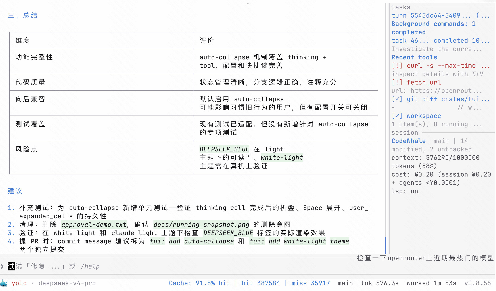

# CodeWhale (TUI fork)

> [Hmbown/CodeWhale](https://github.com/Hmbown/CodeWhale) 的个人 fork，把终端 UI
> 重写成更接近 Claude Code 的 chrome-light 风格，同时保留 CodeWhale 全部专属功能
> （sidebar 四面板、mode 切换、provider chip、reasoning effort chip、sub-agents、
> 文件树、状态指示器等）。

**语言**: [English](README.md) · 简体中文

---

## 截图

启动空态——chat 区直接从 row 0 开始，没有顶部常驻 header，sidebar 跟 chat
共享同一画布。


运行中的一轮对话——thinking 块、tool 调用、sidebar 展示 recent tools 和
session 信息，footer 左侧鲸鱼图标紧贴 `mode · model · cost · saved`，
右侧 `% context left`、`Cache: hit`、`worked` 等 chip。


另一轮活跃截图——以工具输出为主，展示在多个工具卡叠加时 cell rail
仍能保持 chat 可读性。


第三张运行截图——使用全新的 **White Light** 主题：纯白底色，已完成的工具
`[✓]`、模型输出圆点 `●`、cache hit 等强调色统一为 DeepSeek 蓝；完成的 thinking
块和 tool 卡片自动折叠为一行 header，底部提示「Space to expand」可按空格展开。



---

## 新增功能

### White Light 主题

新增 `white-light` 主题——纯白背景、浅灰层次、DeepSeek 蓝（`#487ED2`）作为
强调色，替代其他浅色主题中的绿/青色调。通过以下命令切换：

```
/theme white-light
```

White Light 主题的关键配色：

| 元素 | 颜色 | 色值 |
|---|---|---|
| 完成的 `[✓]` / success 状态 | DeepSeek 蓝 | `#487ED2` |
| 模型输出圆点 `●` | DeepSeek 蓝 | `#487ED2` |
| Cache-hit 显示 | DeepSeek 蓝 | `#487ED2` |
| 高亮 cell 背景 | 浅绿底色 | `#E8F5E9` |
| Diff 新增行 | DeepSeek 蓝 | `#487ED2` |

### 完成的 cell 自动折叠

已完成的 thinking 块和 tool 卡片现在会自动折叠为一行 header +「Space to expand」
提示，让对话区聚焦在最新内容上。在折叠的 cell 上按 <kbd>空格</kbd>（输入框为空时）
即可展开为完整内容。可通过 `/config auto_collapse_completed on|off` 开关。

---

## 这个 fork 是什么

它**不是**独立项目。是 CodeWhale 上游 agent runtime + 重写的 TUI 表现层。
agent loop、模型路由、工具系统、配置格式、slash command、CLI 接口都没动 —— 改的
只是你**看见**的部分。

如果你想要项目本体（文档、安装方式、模型支持、release notes），看上游 README：

➡️ **上游 README**: <https://github.com/Hmbown/CodeWhale/blob/main/README.md>

如果你想下载二进制就直接装上游版本 —— 本 fork 没有发布过，也不会推到 npm /
Cargo / Homebrew。

## 基准版本

本分支 fork 自上游 `main` 的 commit
[`8dff2f7525ead210a01347b48f53ae3f20d094ec`](https://github.com/Hmbown/CodeWhale/commit/8dff2f7525ead210a01347b48f53ae3f20d094ec)
（2026-06-03），对应 **CodeWhale v0.8.53**。需要时手动从上游 rebase / pull；本
fork 不会自动跟进新 release。

## 为什么有这个 fork

CodeWhale TUI 的 chrome 比较密：

- 顶部常驻 header bar（mode + workspace + model + chip 簇）
- Composer 用 `Borders::ALL` 圆角框包裹
- Sidebar 每个 panel 都是完整边框
- Footer 有动画水波带
- Tool cell 外面套 `╭ │ ╰` card frame

并行使用 Claude Code 和 CodeWhale 一段时间后，我希望 CodeWhale 在视觉上跟 Claude
一样安静 —— 同样的 chat 区聚焦感、同样的单线 sidebar、同样的极简 footer ——
但 CodeWhale sidebar 和 chip 实际承载的所有信息都不能丢。

**重写期间的硬规则：**

1. 不动 agent / state-machine / 数据流。纯表现层。
2. 每个 CodeWhale 专属信号（mode、provider、reasoning effort、sub-agents、sidebar
   面板、状态指示器）必须迁移过去 —— 只允许换**位置**，不允许删。
3. 测试每一阶段同步更新，不留 skipped 测试集。

## Phase 进度

迁移计划在
[`docs/TUI_CLAUDE_STYLE_PLAN.md`](docs/TUI_CLAUDE_STYLE_PLAN.md)。共规划 6 个
phase；phase 1–5 加一轮视觉打磨已落到本 fork 的工作树。Phase 6 还没动。

| Phase | 范围 | 状态 |
|---|---|---|
| 1 | Welcome 文案与 accent palette ——单一 ACCENT_PRIMARY、去掉 `#[allow(dead_code)]`、刷新 empty-state 区块、Claude Light theme tokens | ✅ 已 commit |
| 2 | Composer chrome ——上下两条横线（去掉左右边框），输入行装饰性 `> ` 前缀，去掉 density floor 让面板按行增长，idle 状态底部 hint 移除 | ✅ 已 commit |
| 3 | Footer 重构 ——把原 header 上的 chip（ctx、version、live marker、status indicator、receipts）全部吸收，4 层 overflow cascade，transcript & reasoning rail 从 `▏ ` / `╎ ` 改成 `  `，`wrap_card_rail` 变 no-op，`compute_rail_prefix_width` 加 Pattern C，ctx chip 不再用 East-Asian Ambiguous 方块字符 | ✅ 工作树 |
| 4 | 拆掉常驻 header —— `body_area = size`，全部 chip 迁到 footer，`HeaderWidget` 加 `#[allow(dead_code)]` 留作未来 `/status` 嵌入用 | ✅ 工作树 |
| 5 | Sidebar 视觉统一 ——`Borders::TOP` only，小写 small-caps 标题，padding budget 从 −4/−3 收紧到 −2/−1，resize handle idle 时安静、hover/drag 才点亮，移除 sidebar 内联 ASCII 进度条 | ✅ 工作树 |
| Polish | Welcome 用 🐳，footer 左侧用 🐳 做品牌锚点放在 mode 前面，ctx chip 改成纯文本 `64% context left`（85% / 95% 阈值时颜色升级），删掉跟 sidebar recent-tools 面板重复的 activity label，回退 phase 1 改的 placeholder 文案恢复到 7 个 locale 的原版「编写任务或使用 /」 | ✅ 工作树 |
| 6 | Tool / message cell 重写 ——`⏺ <tool>(<arg>)` header + `  ⎿ ` 续行，behind `tui.cell_style = "claude" \| "classic"` feature flag，约 600 行改动 + snapshot 重生成 | ⏳ 未开始 |

Phase 1–polish 全部叠加后的测试态：**3986 passing**、4 ignored、1 个 baseline
flaky（`mcp::tests::legacy_sse_closed_stream_reconnects_and_retries_tool_call`，
并行下挂、单跑通过；这个 flaky 是 fork 之前就有的）。

## 视觉变化

按区域速览：

- **屏幕顶部** —— 没了。chat 区直接从 row 0 开始，welcome block 上面留 3 行
  喘息空间。
- **Welcome block** —— `>_ codewhale (v…)` 标题改成 `🐳 Welcome to CodeWhale`，
  下面是 `/help` / `?` 快捷键提示和一行 `cwd: … model: … v…`。
- **Composer** —— 只剩上下横线，没左右边框，每行输入前面装饰性 `> ` 前缀，没有
  `Composer` / `Draft` 标题（history-search 模式保留标题，因为没别的方式提示用户
  当前状态）。
- **Sidebar** —— 每个 section 一条 dim 顶线，小写 small-caps 标题（`work` /
  `tasks` / `agents` / `context`），panel 底色比 chat surface 略深，作为单独的
  rail 区。
- **Footer** —— `🐳 agent · deepseek-v4-pro · ¥0.13 · saved ¥1.01    ●    Cache:
  75.0% hit  64% context left  v0.8.53`。鲸鱼图标是整行的锚点（turn 进行中循环
  动画，idle 静态），右侧 chip 簇按 4 层 cascade 从尾部丢弃以保证不溢出。
- **Tool cell** —— phase 3 砍掉了 `╭ │ ╰` card frame；tool header glyph + 缩进
  body 就是唯一的视觉框。Phase 6 会重写 body 本身。

## 仓库结构

跟上游一致 —— 详见
[`AGENTS.md`](AGENTS.md)（代码 tour）和
[`docs/`](docs/)（迁移笔记）：

- [`docs/TUI_CLAUDE_STYLE_PLAN.md`](docs/TUI_CLAUDE_STYLE_PLAN.md) —— 迁移
  phase 计划（中文，按文件路径 + 行号钉死了基线）

## 从源码构建

跟上游一致。本 fork 没有改任何外部依赖。

```bash
cargo build -p codewhale-tui --release
cargo test  -p codewhale-tui --bin codewhale-tui
```

上游 GitHub Releases 上的二进制**不**包含本 fork 的 TUI 改动 —— 想看新 UI
必须从本分支自己 build。

## 如何使用

本 fork 没有发布到任何 registry —— 从源码构建后直接使用。

### 前置条件

- **Rust 1.88+**（[rustup.rs](https://rustup.rs)）
- **DeepSeek API key**（[platform.deepseek.com/api_keys](https://platform.deepseek.com/api_keys)）

### 1. 克隆并构建

```bash
git clone https://github.com/ivorzhao/CodeWhale.git
cd CodeWhale
cargo build -p codewhale-tui --release
```

dispatcher 二进制是 `target/release/codewhale`，TUI 运行时是
`target/release/codewhale-tui`。

### 2. 设置 API key

通过环境变量：

```bash
export DEEPSEEK_API_KEY="sk-..."
```

或写入 `~/.codewhale/config.toml`：

```toml
provider = "deepseek"
api_key = "sk-..."
```

完整配置项见 `config.example.toml` 和
[`docs/CONFIGURATION.md`](docs/CONFIGURATION.md)。

### 3. 启动

```bash
./target/release/codewhale
```

CodeWhale 在当前目录启动。给它一个任务，它会读取文件、执行命令、编辑代码 ——
全过程在对话区可见。

### 4. 基本操作

| 操作 | 命令 |
|---|---|
| 切换模式 | `/mode agent`、`/mode plan`、`/mode yolo` |
| 切换模型 | `/model deepseek-v4-flash` |
| 切换 provider | `/provider deepseek` |
| 查看所有命令 | `/help` |
| 清空对话 | `/clear` 或 `Ctrl+L` |
| 打开 sidebar 帮助 | `?` |
| 退出 | `/exit` 或 `Ctrl+C` |

更完整的使用指南见 [`docs/GUIDE.md`](docs/GUIDE.md)。

### 注意事项

除了屏幕上的外观不同，其他方面与上游 CodeWhale 完全一致：
配置格式、slash commands、agent loop、工具系统、模型路由 —— 全都一样用。
上游 [`docs/`](docs/) 下的文档和[上游
README](https://github.com/Hmbown/CodeWhale/blob/main/README.md) 同样适用。

## 回流上游

本 fork 的改动计划在 phase 6 review 完之后回上游。在那之前
`tui-claude-style/phase-3-footer` 工作树是 source of truth，欢迎对本 fork 提
PR。
